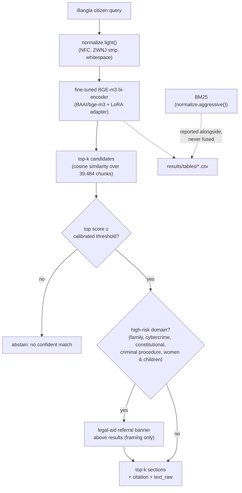
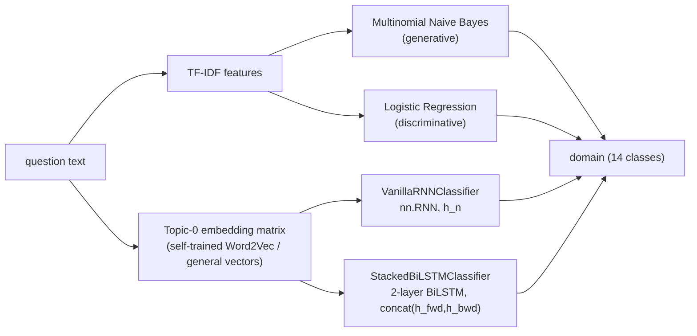
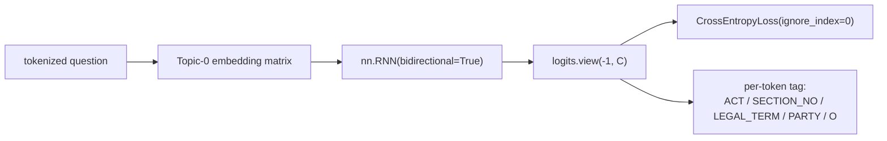
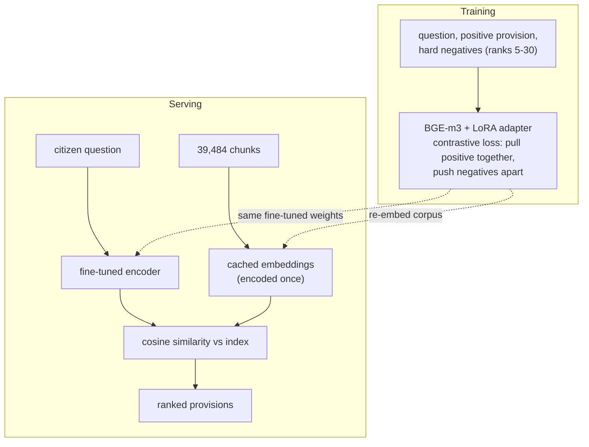
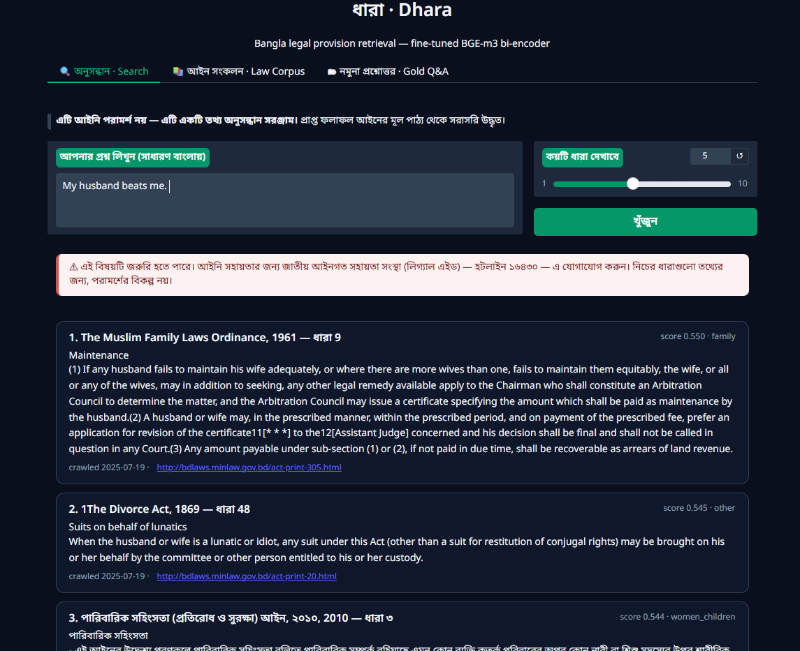
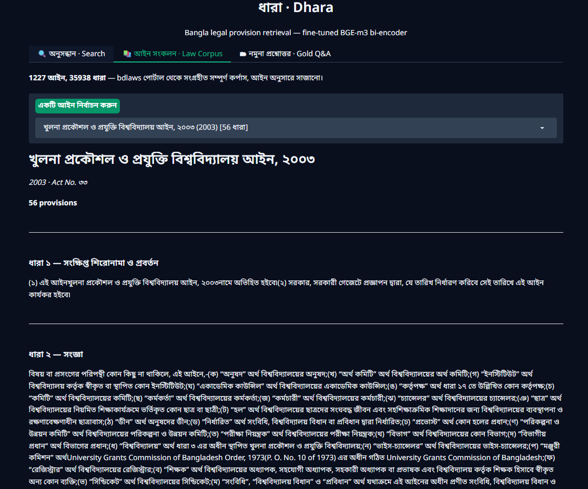
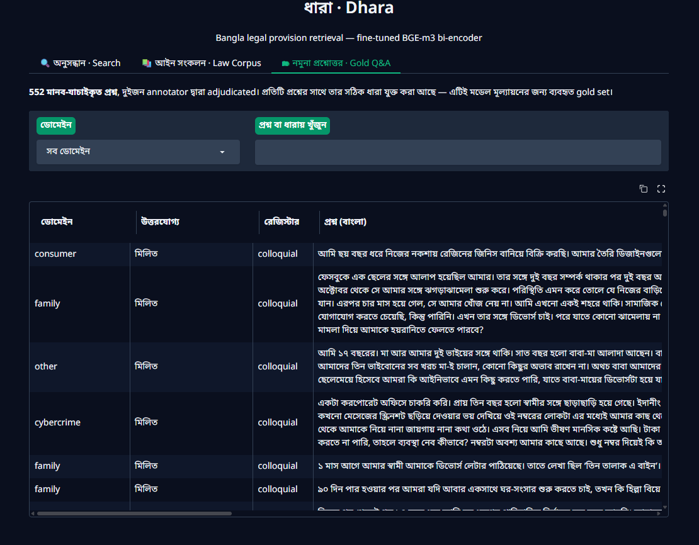

# Dhara

A Bangla legal retrieval system for citizen services.

Dhara takes a plain-Bangla citizen question and returns the exact law section (ধারা), with its
official citation, that answers it. The research claim: a lexical gap separates colloquial
citizen phrasing from formal legal Bangla — and roughly 60% of the answers citizens actually
need live in **English-only** Acts a Bangla-only model cannot represent at all. Domain
fine-tuning is tested against that gap specifically, not against a generic benchmark.

**Status: built.** Corpus, annotation, classification, sequence tagging, and retrieval
fine-tuning are all done — see [docs/PROJECT_REPORT.md](docs/PROJECT_REPORT.md) for the full
narrative and every cited number, [docs/DEFENSE_PREP.md](docs/DEFENSE_PREP.md) for a
defense-oriented cheat sheet, and [DECISIONS.md](DECISIONS.md) for the dated decision log. This
README is the short version.

## Headline result

| stage | metric | value |
|---|---|---|
| BM25 (lexical floor) | Recall@10 | 0.067 (0% on English-only-Act gold) |
| Word2Vec (self-trained, as retriever) | Recall@10 | 0.029 |
| Zero-shot BGE-m3 (locked control) | Recall@10 | 0.324 (480-pool) / 0.472 (n=36 test) |
| **Fine-tuned BGE-m3 + LoRA (v6, final)** | **Recall@10** | **0.500** (test), **+8.3pt on English-target slice** |
| Classification, Logistic Regression (best, human-only) | macro-F1 | 0.343 |
| Sequence tagger, ACT / PARTY tags | entity F1 | 0.857 / 0.627 |

The claim this project stands or falls on: fine-tuning moved English-target test Recall@10 by
+8.3 points (0.333→0.417) — the exact slice the cross-lingual-gap thesis predicts should be
hardest to move. Full ladder, significance tests, and every ablation are in the project report.

## Problem statement

A citizen might ask something like:

> পুলিশ আমাকে ধরে নিয়ে গেছে, কিছু বলছে না — আমার কী অধিকার?

The matching legal language is structured around formal phrasing such as:

> গ্রেপ্তার ও আটক সম্পর্কে রক্ষাকবচ

This is a semantic mismatch, not a spelling problem — real citizen questions share **zero**
content words with their answer provision at the median (measured, not assumed). It is not
trivial keyword matching, and a large share of the answers citizens need exist only in
English-only Acts, so it is not a monolingual problem either.

## Scope

Corpus source: the bdlaws government portal (structured HTML, not OCR) — **39,484 chunks across
1,227 Acts**. Scope is set by *frequency in ordinary civilian life*, not legal taxonomy: which
laws people actually collide with. Confirmed domains: family, land, labour, consumer,
cybercrime, constitutional, criminal procedure, and further daily-life domains added as the
project's own gold data revealed gaps. The authoritative list lives in `configs/domains.yaml`;
every addition is recorded in `DECISIONS.md` with its reason and risk tier.

Repealed or omitted provisions are dropped from the corpus and the dropped count is recorded —
retrieving one would be actual harm, not just a lower score.

## Non-goals

The system does not aim to:

- replace legal professionals or give advice in place of a lawyer,
- cover every Act in the national legal ecosystem,
- answer case-law or judicial precedent tasks,
- support multi-turn legal dialogue.

## System architecture

The pipeline that is actually served is **dense-only**: a fine-tuned bi-encoder retrieves and
ranks candidates directly. BM25 is measured alongside as the lexical floor, never fused in
(equal-weight RRF measured *worse* than dense alone — see "What was tried and didn't ship"
below). There is **no cross-encoder reranker in the served pipeline** — a trained reranker was
built and evaluated as an ablation and it regressed Recall@10 (0.500 → 0.361); that result is
reported honestly rather than shipped.



An intent classifier runs alongside too, reported separately (see Classification below);
intent-based candidate filtering stays an ablation, never the default path, because a wrong
intent prediction would silently destroy retrieval. See [docs/PIPELINE.md](docs/PIPELINE.md) for
how each syllabus topic maps to a system artifact, and why.

## What was built, and what each stage found

Full detail, tables, and root-caused failure history are in
[docs/PROJECT_REPORT.md](docs/PROJECT_REPORT.md). This section covers the three pieces that
actually shipped as system components: classification, sequence tagging, and retrieval.

### Classification (Topic 1) — is a classifier even needed here?

Predicts the question's legal `domain` (14 classes), run as a parallel research track — never
used to filter or reorder retrieval, because a wrong intent prediction would silently damage
results (`configs/domains.yaml` governs domain identity; `src/dhara/classify.py` is the model
code).



| training data | n train | LogReg macro-F1 | NB macro-F1 | Vanilla RNN macro-F1 | Stacked BiLSTM macro-F1 |
|---|---|---|---|---|---|
| human-only (real questions only) | 352 | **0.343 (best)** | 0.105 | 0.152 | 0.150 |
| balanced mix (human + synthetic, filtered) | 1,152 | 0.318 | 0.088 | 0.085 | 0.128 |
| full synthetic pool (unfiltered) | 4,324 | 0.267 | 0.101 | 0.141 | 0.195 |
| full synthetic, rare domains merged | 4,324 | 0.256 | 0.102 | 0.068 | 0.207 |

**Best model: Logistic Regression on human-only data, macro-F1 0.343 — beats every model trained
on 12× more (mostly synthetic) rows.** The generative-vs-discriminative comparison the syllabus
asks for came out cleanly (discriminative wins at this feature dimensionality and data volume),
but the more load-bearing finding was methodological: a stale domain label was silently capping
every model until it was re-derived from the answer Act (LogReg jumped 0.269→0.343 from that fix
alone), and throwing more synthetic training data at the problem made the best model *worse*, not
better, because its source distribution doesn't match the real 200-question test set. Full
attempt history, including two rebalancing techniques that looked reasonable and measurably
regressed, is in the project report §3.2.

### Sequence tagging (Topic 2) — pulling an explicit ধারা number out of a question

`BiRNNSequenceLabeler` (`src/dhara/models/tagger.py`) tags every token `ACT` / `SECTION_NO` /
`LEGAL_TERM` / `PARTY` / `O`, trained on weak labels (regex/gazetteer matching corpus terms into
questions). When a citizen question contains an explicit provision number, the tagger extracts
it so that provision can be boosted directly instead of relying on similarity alone.



| tag | precision | recall | F1 | weak-label training occurrences |
|---|---|---|---|---|
| ACT | 1.000 | 0.750 | 0.857 | 104 |
| PARTY | 0.945 | 0.469 | 0.627 | 952 |
| SECTION_NO | 0.000 | 0.000 | 0.000 | 2 |
| LEGAL_TERM | 0.000 | 0.000 | 0.000 | 155 |
| **entity macro-F1** | | | **0.371** | |

**The tagger reliably learns exactly the two tags citizens actually write in plain language.**
`ACT` and `PARTY` work because citizens do name institutions ("আইন", "সংবিধান") and roles
("স্বামী", "বাদী") directly. `SECTION_NO` has only 2 weak-label occurrences in the entire
training pool — citizens almost never write a bare section number — and `LEGAL_TERM`'s
109-term gazetteer is *formal* register that colloquial questions rarely contain. This is the
same register gap the language-model perplexity measurement (Topic 3) finds independently, in
an unrelated model.

### Retrieval fine-tuning (Topic 5) — the core deliverable

Contrastive fine-tuning of a pretrained multilingual bi-encoder (`BAAI/bge-m3`) on labelled
question→provision pairs, using a LoRA adapter (0.28% of total parameters, sized for a T4's
memory). This is the project's primary supervised result and the one line of work iterated on
the most.



| attempt | result | root cause |
|---|---|---|
| Zero-shot BGE-m3 (control) | R@10 0.324 | locked baseline before any fine-tuning ran |
| Fine-tune attempt 1 | R@10 0.060 | embedding collapse — cross-topic negative contamination, found and fixed |
| Fine-tune attempt 2 | R@10 0.330 (flat) | query-space hubness, root-caused |
| Fine-tune attempt 3 | R@10 ~0.35 | beat zero-shot for the first time |
| Fine-tune "attempt 4" (v5 data) | R@10 flat, R@100 dropped | stale file bug — notebook loaded an old training file with zero mined hard negatives |
| Split rebuilt (v4 splits) | Dev R@10 0.325→0.368 | real human training rows recovered from 52 to 408 |
| **v6 pool, 408 real + 2,685 approved + 942 authored (final)** | **Test R@10 0.472→0.500 (+2.8pt); English-target R@10 0.333→0.417 (+8.3pt)** | first attempt where the English-target slice — the actually hard part — moved at all |

**Why this matters:** English-only Acts hold ~60% of the answers citizens need, and a
Bangla-specialist model cannot represent them at all — this is why `BAAI/bge-m3` (multilingual)
was chosen over a Bangla-only checkpoint, and why every result is reported split by target
language, not just pooled. Every failed attempt above was root-caused and fixed, not shrugged
at — the defensible claim is not "it worked the first time," it's that every failure has a
diagnosed mechanism.

### What was tried and didn't ship

- **Cross-encoder reranker (trained)** — a real, still-open regression: Recall@10 dropped from
  0.500 to 0.361 after training a `BAAI/bge-reranker-v2-m3` reranker on this project's own
  pairs. A stage-1 chunk/provision mismatch bug was found and fixed; the regression persisted
  at the same magnitude afterward, so a second, unidentified cause remains. Not in the served
  pipeline. Full root-cause notes in the project report §5.4.
- **Equal-weight BM25+dense fusion (RRF)** — scored *worse* than dense alone (R@10 0.216 vs
  0.324) because BM25 contributes 0% relevant candidates on ~60% of questions (the English-only
  slice), so half of every fused score was noise.
- **Dual-query translation + sparse/ColBERT hybrid** — BGE-m3's extra retrieval heads, tested as
  a final ablation specifically against the cross-lingual wall. Made things worse (R@10 0.472→
  0.417): the machine-translation step truncated the actual question clause on longer Bangla
  questions, feeding a question-less English query into the fusion.
- **A leaked-answer bug, caught and retracted** — an earlier script hardcoded each question's
  gold Act/section into its own English gloss, then reported the resulting retrieval jump as a
  genuine result. Caught, retracted, and the contaminated files quarantined
  (`data/processed/_archived_leaked_bilingual/`) rather than silently dropped.

## Demo

A three-tab Gradio demo (`src/app/app.py`, backed by `src/dhara/service.py`), serving the v6
fine-tuned checkpoint over the full 39,484-chunk corpus. Deliberately plain, per the
supervisor's own guidance: "a fancy GUI is not required... there should be a clear
input-output system."

**Search** — a plain Bangla question in, cited provisions out, with the permanent "this is not
legal advice" disclaimer and a legal-aid referral banner (never affecting ranking, only framing)
above results for high-risk domains:



**Law Corpus** — all 1,227 Acts, browsable, every provision rendered as a continuous document
with its citation, for a supervisor/committee audience to inspect the underlying data directly:



**Gold Q&A** — all 552 human-adjudicated questions with their resolved answer citation,
filterable by domain and free text — the same population the headline numbers above are
computed from:



## Data pipeline

1. **Act survey** — which Acts have Bangla legal text, how many sections, whether the corpus is
   large enough to proceed.
2. **Scraping** — raw HTML archived before parsing; 1.5–2s delay, honest User-Agent, resumable,
   `crawl_date` recorded per document.
3. **Section splitting** — retrieval unit is the section (ধারা), not the Act. Repealed/omitted
   provisions dropped.
4. **Normalization** — two levels, never interchangeable: `normalize.light()` (NFC, ZWNJ strip,
   whitespace) feeds transformers; `normalize.aggressive()` (+ZWJ strip, digit normalization,
   punctuation padding, lowercasing) feeds BM25/Word2Vec/TF-IDF.
5. **Question collection and annotation** — real questions mined from newspaper legal-advice
   columns (verbatim text git-ignored, only a paraphrase ships publicly) plus quality-gated
   synthetic questions, adjudicated into a 552-row gold pool (480 answerable, 72 deliberately
   unanswerable for abstention calibration). Gold set is touched exactly once per model-selection
   cycle, never for debugging.

## Dataset and schema

Frozen, versioned artifacts under `data/processed/` — `corpus_v1.jsonl` (39,484 chunks),
`gold_verified_v3.jsonl` (552 rows), `train_retrieval_v7.jsonl` / `dev_retrieval_v4.jsonl` /
`test_retrieval_v4.jsonl` (the final human-aware, provision-connected-component split), plus the
mined hard-negative pools. Large generated artifacts (raw scrapes, model checkpoints, full
corpus/synthetic pools over ~50MB) are git-ignored and kept off GitHub — see `.gitignore`.

The `Chunk` schema (`src/dhara/schema.py`) carries the citation metadata as a correctness
requirement: `chunk_id`, `act_name_bn`, `act_year`, `chapter`, `section_no`, `section_title_bn`,
`text_raw`, `text_bn`, `domain`, `source_url`, `crawl_date`, `char_len`. `text_raw` (the law as
printed) is what the UI shows a human reader; `text_bn` is what models consume — never the
reverse.

## Repository structure

```text
configs/     domains.yaml, abstention.json, synth_*.yaml, split configs
data/raw/    scraped HTML — never committed
data/processed/  frozen JSONL artifacts — committed when under GitHub's size limit
src/dhara/   normalize.py, schema.py, scrape.py, section_split.py, synth.py, negatives.py,
             metrics.py, evaluate.py, classify.py, service.py, annotation_round2.py,
             models/{tagger,language_model}.py,
             retrievers/{base,bm25,word2vec,biencoder}.py
src/app/     app.py, browse.py — Gradio demo (Search / Law Corpus / Gold Q&A tabs)
scripts/     01–76, thin CLIs — one job each (numbering has drifted from the implementation
             guide's plan; see CLAUDE.md's "Commands" section for the mapping)
notebooks/   colab_bge_m3_finetune.ipynb, colab_acttitle_and_rerank.ipynb, and later
             fine-tuning/summarization notebook iterations
results/     tables/ figures/ runs/ — one JSON per experiment run, every claim traces here
docs/screenshots/  demo tab screenshots used in this README
```

## Setup

Python 3.10+.

```bash
python -m venv .venv
python -m pip install -r requirements.txt
# BanglaBERT workflows need this separately (not on PyPI):
pip install git+https://github.com/csebuetnlp/normalizer
```

Compute target is a Colab/Kaggle T4; nothing here needs more.

## Commands

See [CLAUDE.md](CLAUDE.md)'s "Commands" section for the current, accurate script list — corpus
build, annotation merge, dense-index evaluation, the synthetic-training-data chain, hard-negative
mining, and diagnostics (hubness audit, rerank scoring, question-diversity). Every citable number
comes out of `scripts/13_eval_dense_index.py` + `scripts/18_compare_runs.py`, never hand-typed.

```bash
python -m src.app.app   # Gradio demo — Search / Law Corpus / Gold Q&A
```

## Evaluation methodology

- **Split by provision-connected-component, not by question** — correlated citizen phrasings of
  the same provision stay together, so none leak across train/dev/test.
- **Every retrieval run JSON carries `per_query`**, so `scripts/18_compare_runs.py` can run a
  paired bootstrap significance test on any claimed delta — a point estimate alone is never
  treated as a real result.
- **Gold set isolation**, enforced by an automatic leakage assertion at data-load time in every
  training notebook.
- At the current test size (n=36), one question is worth ~2.8 points of Recall@10 — every delta
  in the project report is read against that, and several are stated as not-yet-CI-confirmed
  rather than oversold.

## Non-negotiable rules

The full list (gold set isolation, split-by-chunk, freeze-then-version, the two normalization
levels, E5 prefix handling, hard negatives from ranks 5–30, no hand-typed numbers, risk-tier
framing without touching ranking) lives in [CLAUDE.md](CLAUDE.md) — treat it as binding on any
code change, not just documentation.

## Ethics and safety

This is an information-retrieval tool, **not legal advice** — stated in the UI, and in every
document above. Repealed/omitted legislation is excluded from the corpus and the dropped count is
recorded; crawl date is displayed; mined real questions are stripped of names, phone numbers, NID
numbers, and addresses before they enter the dataset; high-risk domains (family, cybercrime,
constitutional, criminal procedure, women & children) get a legal-aid referral banner above
results and a raised abstention threshold — framing only, never a change to ranking logic.

## Team

Two credited members: Sarwad and Iftiaq. Role-based file ownership (normalize/scrape/schema;
synth/negatives; metrics/evaluate/classical retrievers; biencoder/rerank/service/app) is recorded
in CLAUDE.md; `DECISIONS.md` is the running log of who decided what and why.

## Documentation map

- [docs/Dhara_Proposal.md](docs/Dhara_Proposal.md) — the *why*: problem framing, scope, ethics.
- [docs/Dhara_Implementation_Guide.md](docs/Dhara_Implementation_Guide.md) — the *how*: schemas,
  hyperparameters, per-phase owners.
- [docs/PIPELINE.md](docs/PIPELINE.md) — maps syllabus topics to system artifacts.
- [docs/PROJECT_REPORT.md](docs/PROJECT_REPORT.md) — the full narrative, every cited number.
- [docs/DEFENSE_PREP.md](docs/DEFENSE_PREP.md) — defense-oriented cheat sheet.
- [docs/TECH_STACK.md](docs/TECH_STACK.md), [docs/PROJECT_STRUCTURE.md](docs/PROJECT_STRUCTURE.md) —
  reference material for onboarding into the codebase.
- [DECISIONS.md](DECISIONS.md) — dated decision log, the raw material for the methodology chapter.
